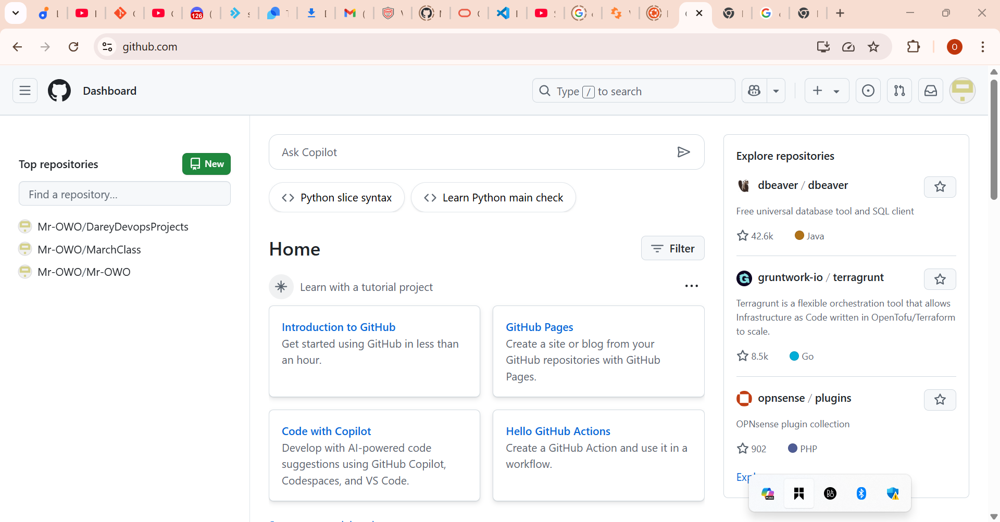

# Tech Envionment Setup

## Project Prerequisites
- Completetion of Tech Environment Courses
- **Internet Connection**: Required for accessing cloud services, documentation and online repositories.
- **Computer**: Adequate performance to run virtual machines and containers(minimum 8GB RAM recommended) 64GB highly recommended.
  
## Tools Needed to be installed

- Visual studio Code(VScode)
- Git
- Virtual Box
- Ubuntu on Virtual Box (Windows)
  
## Accounts to be created
- Github Account
- Amazon Web Services (AWS) account

## Installing Software Tools

### Visual Studio Code (VScode)
Visual Studio Code (VS Code) is a powerful, lightweight, and versatile code editor developed by Microsoft, designed for a wide range of programming languages and development tasks. Available across Windows, macOS, and Linux, it offers features like IntelliSense for smart code completion, integrated Git support for seamless version control, and an in-built terminal for command-line operations. Its vast extension marketplace allows users to customize the editor with additional tools, debuggers, and themes, making it adaptable to various development workflows. VS Code is widely praised for its speed, flexibility, and robust features, making it a top choice among developers.

#### 1. **Windows installation**
- Download Vscode: Go to [Visual studio Website](https://code.visualstudio.com/)
  
  
- On the webpage click download for windows
  
  

- **Run installer**: Locate the downloaded .exe file , double click to run the installer.
- **Wizard**: Click "next" through the installation wizard. Click next to all the remaining prompt.
- **Install**: Lastly, click install to tyhe complete the installation. when the installation is complete click FINISH to comolete the instalation.
- **Lauching Vscode**: Open from Start Menu or us the dekstop shortcut or betters till, just tpe vscode on windows app search.

IF your installation is successful, it will have the following look after launching: it might look slightly different but it does not matter.

### Git
- **Download Git**: Go to [Git Website for windows](https://git-scm.com/downloads/win)
  

- On the webpage, click "Download" to download the Git installer for windows
  

- **Run Installer**: Locate the downloaded .exe file, double-click to run the installer
- **Options to check if prompted**: "Use Git from the Windows Command Prompt"."Use the OpenSSL library". "Checkout as-is". Commit as-is. "Use windows' default console window".
- **Install**: Lastly, click install to complete the installation. when installation is complete, click FINISH to complete the installation.
- **Launch Git**: Open from Start Menu or use the dektop shortcut or better still, just type "Git " in windows app search.

**If your instasllation is successful, it will have the folowing look after launching: it might look slightly different, but it does not matter**.

### Virtual Box

- **Download Virtual Box**: Go to [Oracle Virtual box website](https://www.oracle.com/ng/virtualization/technologies/vm/downloads/virtualbox-downloads.html)
  
- On the webpage, click the 'Downloads' and select the windows version
  

- **Run Installer**: Locate the downloaded .exe file, double-click the installer
- **Wizard**: Click "Next" through the installation wizard. Click remaining prompt, leave every option to "default"
- **Install Virtual Box**: lastly, click install to complete the installation, when installation is complete, click FINISH to complete the installation
- **Launching Virtual Box**: Open the start menu or use the dekstop shortcut.
If your installation is successful, it will have the following look.

### Ubuntu(Linux Distro) on Virtual Box

- **Download Ubuntu Dektop IS file**: Go to [Ubuntu official website](https://ubuntu.com/download/desktop)
  

- **Virtual Box**: Launch your already installed virtual box
  
- **Create a New Virtual Machine**: To create a new VM, click on New or Plus symbol at the top center of the virtual box window.
  
- **Configure a New Virtual Machine**: Choose linux as the type, and ubuntu as the version. allocate atleast 2gb of RAM for the virtual machine, create a virtual hard disk, choose either dynamic or fixed size,"dynamic" recommended.
  

- **Select an installation file**: choose the ubuntu .iso file that you downloaded from ubuntu website.
  

- **Start the Virtual Machine**: Launch the virtual machine and start the ubuntu installation process
  
- **Install Ubuntu**: Follow the on-screen instructions to install ubuntu, configuring language, keyboard, user account etc.
- **Complete installation**:  Remove the installation media when prompted, then power off the virtual machine, and ubuntu will boot to desktop as shown below, then you can enter the login credentials you created during the installation. ubuntu will boot to desktop as shown below, then you can enter the login credentials you created during the installation.
  

## Creating Github and AWS account
- **Visit the GitHub website**: open the web browser and go to [GitHub's Website](https://github.com)
  

- **Signup**: On the GitHub Homepage, you will find a "sign up"  button. Clicl on it.
- **Enter your information**:  Fill out the required information on the Sign up page. This typically includes your username, email address, and password. Choose a strong and secure password.
- **Verify Your Email**:  After entering your information, GitHub will ask you to verify your email address. Check your email inbox for a verification message from GitHub and click on the verification link.
- **Complete the CAPTCHA**:  GitHub may ask you to complete a CAPTCHA to ensure that you are not a robot. Follow the instructions to prove you're a human. 
- **Choose a Plan**:  GitHub offers free plans for public repositories and paid plans for private repositories. Choose the plan that best suits your needs. For beginners, the free plan is usually sufficient.
- **Tailor Your Experiences (Optional)**:  GitHub may ask you to answer a few questions to tailor your experience. You can choose to answer them or skip this step. GitHub may ask you to answer a few questions to tailor your experience. You can choose to answer them or skip this step.
- **Welcome to GitHub**: Once you've completed the above steps, you should be redirected to your new GitHub account. Congratulations! You should be redirected to your new GitHub account. Congratulations! You now have a GitHub account.
- **Explore GitHub**: Take some time to explore the GitHub platform. Familiarize yourself with the interface, and you can start by creating a new repository if you have a project in mind.
  

### Amazon Web Services(AWS) Account

- **Visit the AWS Free Tier page**: Go to the AWS free Tier page at [AWS Website](https://aws.amazon.com/free) to learn about the services available in the free tier and to start the signup process.